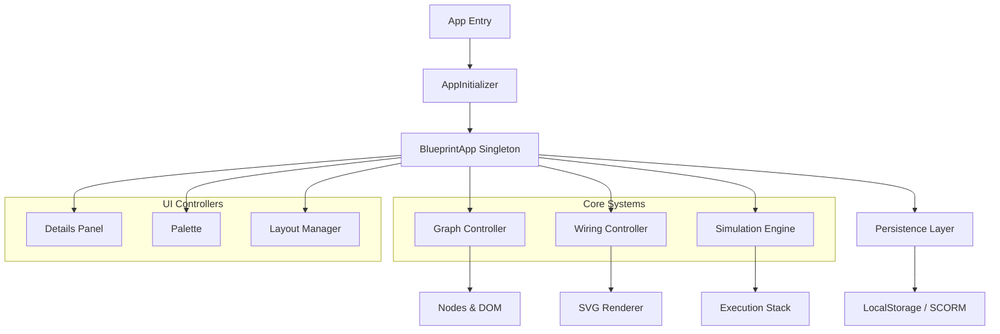

# UE5 Blueprint Editor Replica

A professional-grade, web-based simulation of the Unreal Engine 5 Blueprint Editor, designed for Learning Management Systems (LMS) and SCORM compliance.

## Vision

To provide a pixel-perfect, highly responsive visual scripting environment that mirrors the UE5 experience directly in the browser. This project serves as a cornerstone for interactive assessment tools where students can demonstrate logic flow mastery without requiring a full engine installation.

## Key Features

- **Visual Scripting**: Full support for node creation, wiring, and logic flow execution.
- **SCORM 1.2 Compliance**: Seamless integration with LMS platforms for grade reporting and state persistence.
- **Real-time Simulation**: JavaScript-based execution engine that visualizes logic flow with active wire pulses.
- **Professional UI**: Accurate recreation of UE5 panels (My Blueprint, Details, Palette, Compiler Results).
- **Hot Reloading**: Instant feedback and state rendering.

## Architecture

The system follows a modular, event-driven architecture designed for maintainability and scalability.



### Core Modules

- **WiringController**: Manages connection logic using a Facade pattern over `WireManager`, `WireRenderer`, and `WireInteraction`.
- **SimulationEngine**: Handles the execution of the node graph, managing control flow and data evaluation.
- **AppInitializer**: Bootstraps the dependency injection container and binds global events.
- **NodeRegistry**: Centralized definition system for all available nodes (Events, Actions, Variables).

## Setup & Development

### Prerequisites

- Node.js (v18+ recommended)
- NPM

### Installation

```bash
npm install
```

### Running Locally

```bash
npm run preview
```

This will start a local server at `http://localhost:8000`.

### Testing

```bash
npm test
```

*Note: Tests currently run in-browser via `index.html`.*

## Technology Stack

- **JavaScript (ES Modules)**: No build step required for core logic (Zero-Compile).
- **HTML5 Canvas & SVG**: Hybrid rendering for performant grids and crisp wires.
- **CSS Grid/Flexbox**: Responsive, panel-based layout matching UE5.

## License

MIT
